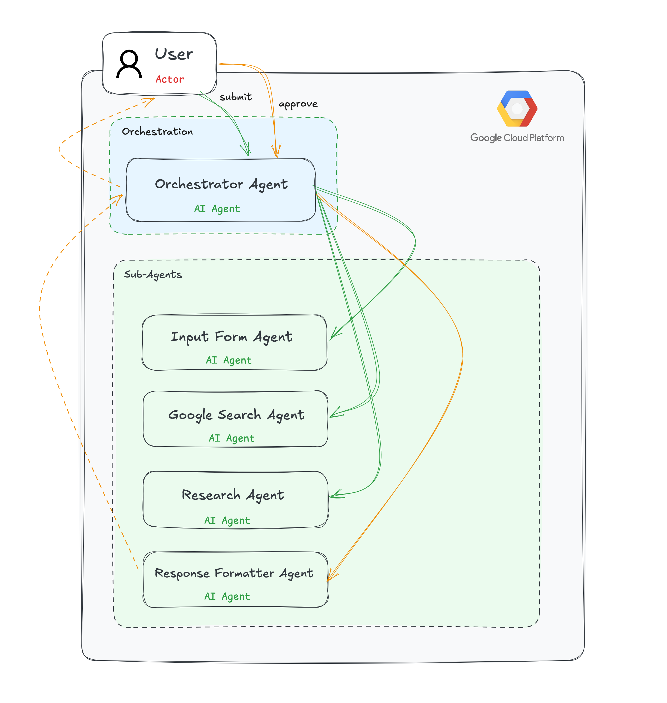

# 🏋️ AI Body Weight Assistant

[](https://genaiacademy.withgoogle.com/)

An advanced, multi-agent AI assistant designed for the **GenAI Academy Hackathon**. It helps users achieve their fitness and weight management goals through personalized research, synthesis, and structured planning.




## 🌟 Overview

The **Body Weight Assistant** leverages a sophisticated **Single-Orchestrator Architecture** built on the Google Agent Development Kit (ADK). It coordinates specialized sub-agents to move users through a seamless journey from data collection to a finalized, actionable fitness guide.

## 🚀 Key Features

- **Personalized Assessment**: Collects 7 key fitness metrics including weight, target goals, activity levels, and dietary preferences.
- **Automated Background Research**: Uses Google Search to retrieve authoritative nutritional and exercise data tailored to individual metrics.
- **Intelligent Synthesis**: Synthesizes raw research into a comprehensive weekly meal and workout strategy.
- **Stateful Orchestration**: 
  - **Resume Capability**: Automatically detects where the user left off if a session is interrupted.
  - **Human-in-the-Loop**: Pauses for user approval after research synthesis before finalizing the guide.
- **Empathetic Coaching**: Delivers responses in a motivational "fitness coach" persona.

## 🛠️ Architecture

The system is powered by **Gemini 2.5 Flash** and organized into several modular components:

| Component | Responsibility |
| :--- | :--- |
| **Orchestrator (`root_agent`)** | Manages the workflow, handles state transitions, and coordinates sub-agents. |
| **`input_form_agent`** | Ensures all required metrics are gathered accurately. |
| **`google_search_agent`** | Retrieves real-world benchmarks and data points. |
| **`research_agent`** | Synthesizes complex data into a personalized strategy. |
| **`response_formatter_agent`** | Polishes and formats the final plan for user consumption. |

## 📂 Project Structure

```bash
body-weight-assistant/
├── body_weight_assistant/
│   ├── agent.py          # Root Orchestrator definition
│   ├── sub_agents.py     # Specialized agent implementations
│   ├── tools.py          # State management and utility tools
│   ├── models.py         # Pydantic data models
│   └── prompt.py         # Core Orchestrator logic and scenarios
├── tests/
│   └── test_agents.py    # Comprehensive test suite
├── agent_pattern.png     # Architecture diagram
└── pyproject.toml        # Dependency management
```

## 🏗️ Getting Started

### Prerequisites
- Python 3.13+
- Google ADK installed and configured

### Installation
```bash
# Clone the repository
git clone https://github.com/your-repo/body-weight-assistant.git
cd body-weight-assistant

# Install dependencies using uv or pip
uv sync
```

### Running the Assistant
```bash
adk run body_weight_assistant
```

### Running Tests
```bash
# Using the local virtual environment
export PYTHONPATH=$PYTHONPATH:.
./.venv/bin/pytest tests/test_agents.py
```

## 👤 Author

**Danny Khant**  
📧 [dannypmkhant@gmail.com](mailto:dannypmkhant@gmail.com)

---
*Built with ❤️ for the GenAI Academy Hackathon.*
